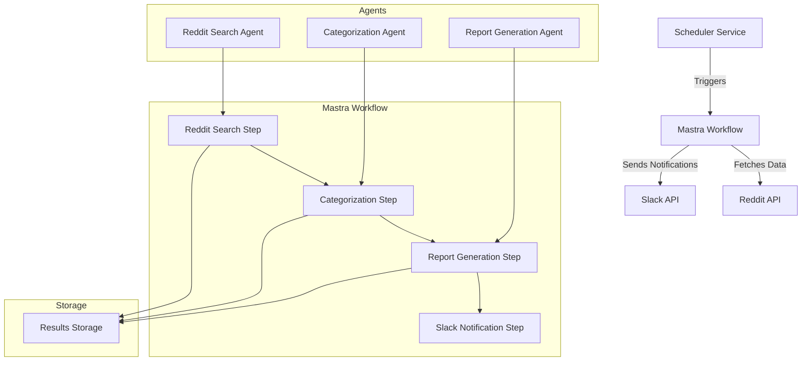

# Design Document: Reddit Scraper Workflow

## Overview

The Reddit Scraper Workflow is designed to monitor, collect, analyze, and report on Reddit discussions related to competitor AI agent and workflow frameworks. The system will run daily, collecting the latest posts and comments that mention specific keywords like langgraph, langchain, n8n, crewAI, etc. The collected data will be categorized, analyzed for sentiment, and compiled into reports that are sent to team members via Slack.

This design document outlines the architecture, components, interfaces, data models, error handling, and testing strategy for implementing the Reddit Scraper Workflow.

## Architecture

The system will be composed of two main parts:

1. **Mastra Workflow Application**: Contains the core workflow logic, agents, and tools for Reddit scraping, content analysis, report generation, and Slack notification.

2. **Scheduler Service**: A separate service using BullMQ for scheduling the daily execution of the workflow.

### High-Level Architecture Diagram



## Components and Interfaces

### 1. Mastra Workflow Components

#### 1.1 Reddit Search Step
- **Purpose**: Search Reddit for posts and comments containing specified keywords
- **Inputs**: Keywords list, time range (default: last 24 hours)
- **Outputs**: Collection of Reddit posts/comments with metadata
- **Dependencies**: Reddit MCP client

#### 1.2 Categorization Step
- **Purpose**: Analyze and categorize collected Reddit content
- **Inputs**: Collection of Reddit posts/comments
- **Outputs**: Categorized posts with sentiment analysis
- **Dependencies**: Categorization Agent

#### 1.3 Report Generation Step
- **Purpose**: Generate a structured report from the categorized data
- **Inputs**: Categorized posts with sentiment analysis
- **Outputs**: Formatted report with summaries and highlights
- **Dependencies**: Report Generation Agent

#### 1.4 Slack Notification Step
- **Purpose**: Send the generated report to Slack
- **Inputs**: Formatted report
- **Outputs**: Confirmation of successful delivery
- **Dependencies**: Slack API client

### 2. Agents

#### 2.1 Reddit Search Agent
- **Purpose**: Interface with Reddit API to search for relevant content
- **Capabilities**: Search by keywords, filter by time, handle pagination, respect rate limits
- **Tools**: Reddit MCP client

#### 2.2 Categorization Agent
- **Purpose**: Analyze content sentiment and categorize posts
- **Capabilities**: Sentiment analysis, content categorization, explanation generation
- **Model**: OpenRouter AI model (e.g., moonshotai/kimi-k2)

#### 2.3 Report Generation Agent
- **Purpose**: Create structured, readable reports from categorized data
- **Capabilities**: Data summarization, highlight identification, report formatting
- **Model**: OpenRouter AI model (e.g., openai/gpt-4o-mini)

### 3. Scheduler Service

#### 3.1 BullMQ Queue
- **Purpose**: Manage scheduled jobs for triggering the workflow
- **Capabilities**: Job scheduling, retry logic, persistence

#### 3.2 Worker Process
- **Purpose**: Execute scheduled jobs by triggering the Mastra workflow
- **Capabilities**: Error handling, logging, workflow invocation

## Data Models

### 1. Reddit Post/Comment
```typescript
interface RedditItem {
  id: string;
  type: 'post' | 'comment';
  title?: string; // Only for posts
  body: string;
  author: string;
  subreddit: string;
  url: string;
  created_utc: number;
  score: number;
  num_comments?: number; // Only for posts
  parent_id?: string; // Only for comments
}
```

### 2. Categorized Item
```typescript
interface CategorizedItem {
  item: RedditItem;
  category: 'NEGATIVE' | 'ALTERNATIVES' | 'OTHER';
  explanation: string;
  keywords: string[]; // Which keywords were matched
  competitor: string; // Which competitor was mentioned
}
```

### 3. Report
```typescript
interface Report {
  date: string;
  summary: {
    totalItems: number;
    categoryCounts: Record<string, number>;
    competitorCounts: Record<string, number>;
    topItems: CategorizedItem[]; // Top items by score
  };
  categories: {
    [category: string]: CategorizedItem[];
  };
  generatedAt: string;
}
```

### 4. Configuration
```typescript
interface RedditScraperConfig {
  keywords: string[];
  competitors: string[];
  timeRangeHours: number;
  slackWebhookUrl: string;
  slackChannel: string;
  importantThreshold: number; // Score threshold for tagging team members
  teamMembers: string[]; // Slack user IDs to tag for important items
}
```

### 5. Scheduler Job
```typescript
interface SchedulerJob {
  id: string;
  type: 'reddit-scraper';
  status: 'waiting' | 'active' | 'completed' | 'failed';
  data: {
    configOverrides?: Partial<RedditScraperConfig>;
  };
  createdAt: Date;
  scheduledFor: Date;
  completedAt?: Date;
  attempts: number;
  error?: string;
}
```

## Error Handling

### 1. Reddit API Errors
- Implement exponential backoff for rate limiting
- Cache partial results to avoid data loss on temporary failures
- Log detailed error information for debugging

### 2. Agent Processing Errors
- Implement timeout handling for agent operations
- Provide fallback categorization for items that fail AI processing
- Maintain transaction logs for recovery

### 3. Slack Notification Errors
- Implement retry logic with configurable attempts
- Store reports locally as fallback if delivery fails repeatedly
- Send error notifications to a monitoring channel

### 4. Scheduler Errors
- Implement job persistence to survive service restarts
- Use BullMQ's built-in retry mechanisms
- Monitor failed jobs and provide alerts

## Testing Strategy

### 1. Unit Tests
- Test individual components with mocked dependencies
- Validate data transformations and business logic
- Test error handling paths

### 2. Integration Tests
- Test interaction between workflow steps with mocked external services
- Validate data flow through the entire workflow
- Test configuration changes

### 3. Agent Tests
- Test agent prompts with sample inputs
- Validate categorization accuracy
- Test report generation quality

### 4. End-to-End Tests
- Test the complete workflow with sandbox Reddit API
- Validate scheduler triggering workflow
- Test actual Slack message delivery to test channel

### 5. Performance Tests
- Test with varying volumes of Reddit data
- Measure processing time and resource usage
- Identify bottlenecks

## Implementation Considerations

### 1. Configuration Management
- Store configuration in environment variables and config files
- Implement a configuration validation mechanism
- Allow runtime updates to configuration

### 2. Monitoring and Logging
- Implement structured logging throughout the system
- Track key metrics (items processed, categorization distribution, etc.)
- Set up alerts for critical failures

### 3. Security
- Securely store API credentials
- Implement proper authentication for scheduler service
- Validate and sanitize all external inputs

### 4. Scalability
- Design for potential increase in keywords and competitors
- Consider sharding by subreddit or time period if volume increases
- Implement caching for frequently accessed data

### 5. Deployment
- Package Mastra workflow as a standard Mastra application
- Deploy scheduler as a separate Node.js service
- Use Docker for containerization
- Consider serverless options for the scheduler service